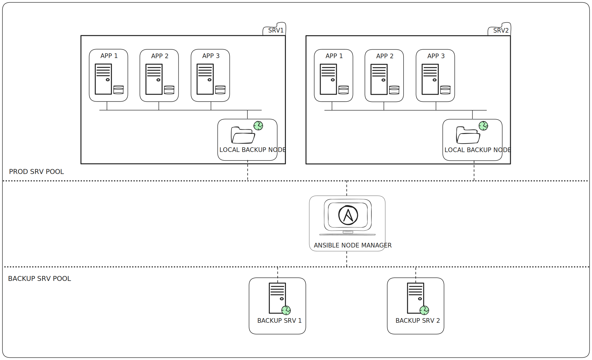

> << The only backup you ever regret is the one you didn't make. >>

In this repo, I present a simple backup strategy. I design it simple and I present you the different ways you can use it. 

Feel free to use It as repere for your next backup plan implementation.

Managing well application database and/or files backup can be a very dauting task.

I take a moment to design this simple backup strategy 

They are several way to perform Backups (Full, Incremental, Differencial, etc...). The only one I cover here is the full backup process.

But for other backup strategies, this is still valid.

I abord 4 key points 

- 1- backup process isolation
- 2- Gather and keep multiple backup copy (3 at least)
- 3- Allerting
- 4- Backup testing

# 1- backup process isolation

I think, this is the most important key. If your app is running on Linux, create a secifique user that will be responsible of backups performing. This allow you to isolate the process so even in case of attack, we can keep a certain level of confidentility if the account is not corrupt. (Think also to apply the principle of least privilege. On your backups files)

# 2- Gather and keep multiple backup copy (3 at least)
THis point can be delegate to a simple script or a configurration management tool like Ansible, who can gather backups

# 3- Allerting 
Allerting can be done at any point (1 and/or 2) Generaly it is a simple backup size checking. This allows us to see if the file is created. 
Once it done, we must send a mail to system enginneer or the person related to this role.

# 4- Backup testing
Yo can do this at a regular frequence (frequqence moin reguliere). To ensue that we can restore backups in case of disaster.

